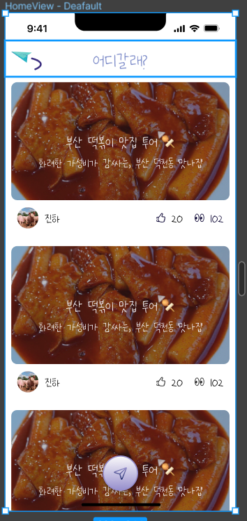

<p align="center">
  <a href="http://nestjs.com/" target="blank"></a>
</p>

[circleci-image]: https://img.shields.io/circleci/build/github/nestjs/nest/master?token=abc123def456
[circleci-url]: https://circleci.com/gh/nestjs/nest

  <p align="center">A progressive <a href="http://nodejs.org" target="_blank">Node.js</a> framework for building efficient and scalable server-side applications.</p>
    <p align="center">
<a href="https://www.npmjs.com/~nestjscore" target="_blank"></a>
<a href="https://www.npmjs.com/~nestjscore" target="_blank"></a>
<a href="https://www.npmjs.com/~nestjscore" target="_blank"></a>
<a href="https://circleci.com/gh/nestjs/nest" target="_blank"></a>
<a href="https://coveralls.io/github/nestjs/nest?branch=master" target="_blank"></a>
<a href="https://discord.gg/G7Qnnhy" target="_blank"></a>
<a href="https://opencollective.com/nest#backer" target="_blank"></a>
<a href="https://opencollective.com/nest#sponsor" target="_blank"></a>
  <a href="https://paypal.me/kamilmysliwiec" target="_blank"></a>
    <a href="https://opencollective.com/nest#sponsor"  target="_blank"></a>
  <a href="https://twitter.com/nestframework" target="_blank"></a>
</p>
  <!--[](https://opencollective.com/nest#backer)
  [](https://opencollective.com/nest#sponsor)-->

## Description


## Running the app

```bash
# development
$ npm run start

# watch mode
$ npm run start:dev

# production mode
$ npm run start:prod
```

## Checking Swagger Document

로컬에서 실행 시 아래 입력
```bash
$ docker compose up
```

## 인기도 모델

저희 앱의 메인화면은 근래동안 사용자에게 추천할 만한 
인기 게시물들을 리스트로 나열하는 화면으로 구성되어 있습니다.



아래에서 사용할 용어는 다음과 같습니다.

$ {score}: 인기도 $ 

$ {like}: 좋아요수 $

$ {view}: 조회수 $ 

- 게시글의 인기도를 종합하기 위해 초기에 생각한 모델은 아래와 같습니다.

  $ {score} = \alpha * {like} + (1-\alpha) * {view} \newline $
  $ {where} \space 0 < \alpha < 1 $ 
  
  좋아요 수와 조회수 간에 가중치를 주어
  1. 사용자에게 노출이 많을 수록
  2. 사용자에게 좋은 반응을 얻을 수록
  
  인기 게시글이라고 보았습니다.

  그러나 이 모델엔 맹점이 있는데,
  최신의 정보와 오래된 정보가 똑같은 가치를 가진다는 것입니다.

  아무리 최신의 인기글이어도, 좋아요 수와 조회수를 역전하지 못하면
  1년전 게시글보다 인기 게시글로 가치를 인정받지 못합니다.

  저희 팀은 인기 게시글 조회에서 이것을 일단 단순 필터링으로 해결하였습니다.
  (지금 시간으로부터 n주전 업로드 게시물만 조회)

- 시간적 요소를 고려하기 위해 몇 가지 레퍼런스를 찾아보았습니다.
  
  1. 우선 Haker News라는 플랫폼에선 아래와 같은 모델을 사용한다고 합니다.

  > $ {score} = {{pageviews} - 1}/({age} + 2)^{gravity} $

  age는 말 그래도 게시글이 업로드된 시간을 의미하며, gravity는 시간에 영향을 받을 속도를 결정합니다.

  통상 1.8 정도의 상수로 둔다고 하니 시간이 지남에 따라 페이지의 인기도는 기하급수적으로 떨어질 것입니다.

  2. 다음으론 Reddit의 모델을 살펴보겠습니다.

  > $ {score} = \log_{10}(ups - downs) + (sign(ups - downs) * {seconds})/45000 $

  ups는 추천, downs는 비추천, seconds는 업로드된 절대 시간초입니다.
  첫 항에 로그를 취해 초기 추천수가 늘어날 때 score의 증가속도가 빠르고
  이미 추천수가 많은 게시글은 인기 증가속도가 점차 줄어들게 됩니다.

  한편, 두번째 항은 seconds가 절대 시간으로 Haker News와 달리 늦게 업로드될 수록 가중치가 높게 평가됨을 의미합니다.
  
  두 모델 모두 각자의 방법으로 시간이 지남에 따라 기존 정보의 가치를 하락시키고 있는 모습을 확인할 수 있습니다.

- 조금 더 나은 방법은 없을까?

  위의 두 방법 모두 좋은 레퍼런스가 되지만, 저희는 두 번째 문제가 있다고 보았습니다.

  1. 모든 조회수와 좋아요수가 같은 가치를 가지는가?

  어제 늘어난 조회수와 오늘 늘어난 조회수는 다른 가치를 지닌다고 생각합니다.
  만약 일주일 전 업로드되어 조회수가 같은 두 게시글이 있는데,

  업로드되자마자 빠른 속도로 조회수가 늘어난 게시글이 있고,
  뒤늦게 주목받아 어제 막 조회수가 늘어난 게시글이 있다면

  어떤 게시글이 먼저 추천받아야 할까요?

  위의 두 모델은 두 게시글이 모두 같은 정도로 평가받게 설계되어있습니다.

  물론 이 정도만 해도 충분히 의미있는 지표가 되겠으나,
  
  저희는 조금 더 의미있는 지표를 만들어보고 사용자에게 제공해보고 싶습니다.

  2. 기술적으로 효율적일까?
  
  여러가지 방법이 있겠지만, 당장 위의 방법을 구현할려면 인덱싱을 이용해야 할 것 같았습니다.

  그런데, 좋아요와 조회수는 아주 빈번하게 수정될 수 있는 요소로 매번 조회마다 조회수를 업데이트하고 좋아요수를 반영한다면

  인덱스 테이블 정렬도 빈번하게 수정되어야 하고 이는 상당히 비효율적일 것입니다.

  대안으로 일정 주기로 조회수와 좋아요 수는 redis 등을 이용해 따로 저장하다가

  데이터베이스에 bulk operation으로 반영하는 방법이 있겠습니다.

  그런데 이렇게 뒤늦게 좋아요와 조회수를 반영한다면 뒤이어 말할 모델이 좀 더 낫지 않을까 생각이 들었습니다.
  
- 저희가 생각해본 모델은 아래와 같습니다.

인기도의 측정은 일정 주기로 업데이트되며, 매 구간을 순서대로 나열하여 임의로 n번째라고 대충 칭하겠습니다.

$ {score}_{n} $ : n 번째 인기도 

$ {view}_{n} $ : n 번째 interval에 올라간 조회수

$ {like}_{n} $ : n 번째 interval 날 좋아요 수

$ {score}_{n} = \alpha*{score}_{n-1} + (1 - \alpha)*({{view}_{n}} + \beta * ({like}_{n})) $

$ 0<\alpha<1, \space 0<\beta $

n-th interval 동안 각 게시글의 인기도는 $ {score}_{n} $으로 평가받습니다.

첫 항은 이전 동안 누적된 인기도를 의미합니다. $ \alpha $가 1보다 작기 때문에 누적된 인기도는 반드시 시간이 지날 수록 줄어듭니다.

가장 최신에 기록된 좋아요와 조회수는 두 번째 항으로 반영됩니다.
모든 좋아요와 조회수는 기록된 직후에 가장 큰 영향력을 가지고 시간이 지날 수록 영향력이 작아집니다.

좋아요와 조회수가 다른 영향력을 가져야 한다고 생각했기 때문에 $ \beta $를 따로 추가했습니다.

이제 적절한 time interval로 서비스에 지장이 가지 않게 게시글의 인기도를 업데이트해주면 됩니다.

- 다만, 조금 더 고려해줄 점이 두가지 있다고 생각이 들었는데요.

  1. 만약 글을 처음 올린 날은 어떡하지?

  이 부분에 대해선,

  $ score_0 = view_0 + \beta * like_0 $

  와 같이 초항을 넣어 초기 조회수에는 특별히 가산점을 주는 것이 좋겠다고 생각이 들었습니다.

  2. 또 하나, 게시글이 초기에 인기가 없었던 게시글이 뒤늦게 주목받는다면?

  이 부분에 대해서 고려해보았을 때,

  이전의 반응이 이미 좋았던 게시글보단 어제 반응이 안좋다가 갑자기 주목받는 게시글이
  
  더 높은 가중치를 평가받아야 생각이 들었습니다.

  그래서 이론적인 것 뿐이긴 하지만,

  현재 생각한 모델은 아래와 같습니다.


  $ let \space {score}_{0} = {view}_{0} + \beta * {like}_{0} \newline $
  $ {score}_{n} = \alpha * {score}_{n-1} + (1 - \alpha) * ({view}_{n} + \beta * {like}_{n}) * \frac{\gamma}{{score}_{n-1} + 1} $